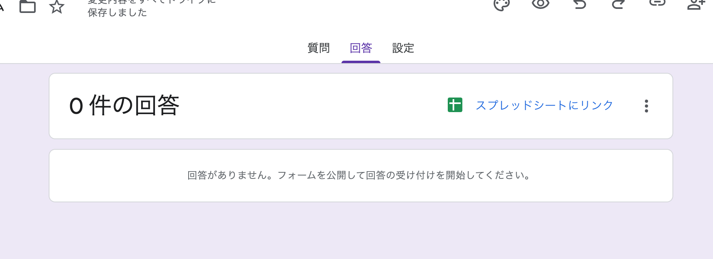
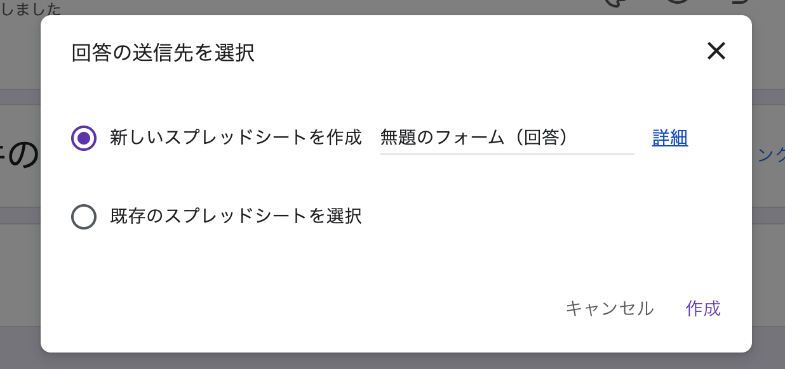
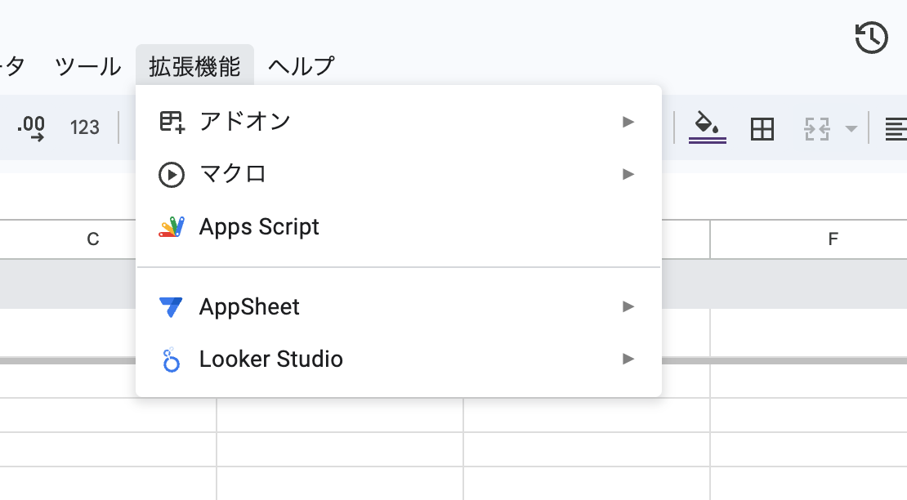
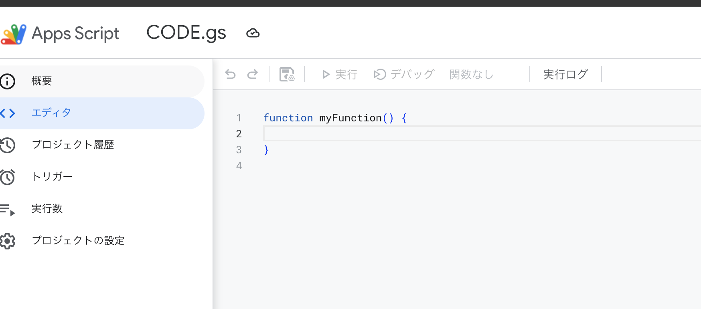
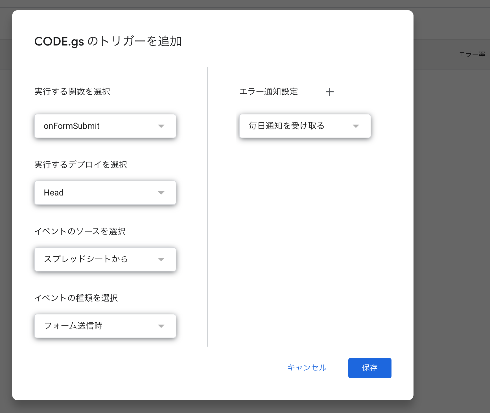
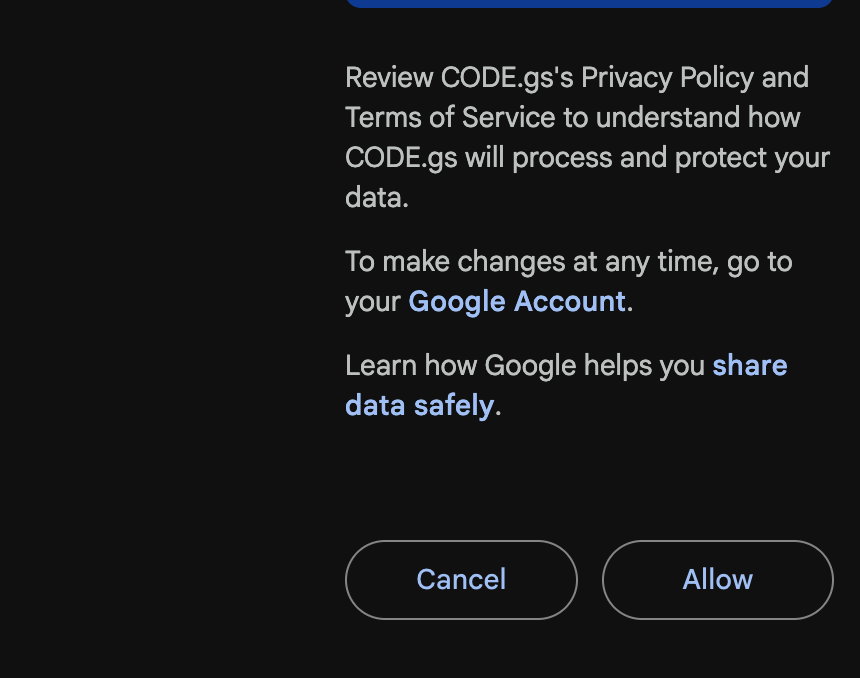
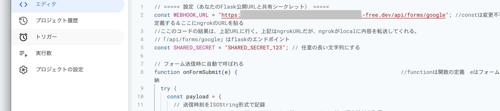
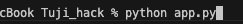

# Googleフォーム連携 Flask アプリ

Googleフォーム → Googleスプレッドシート → Flaskアプリ というデータ連携を実現する手順です．  
Google Apps Script を用いてフォーム回答をWebhook経由でFlaskに送信し，ローカル開発環境を ngrok で公開します．

---

## フォームの実行手順

1. Googleフォームの **回答タブ** をクリックし，「スプレッドシートにリンク」をクリック  
   

2. 「新しいスプレッドシートを作成」を選択し，「作成」をクリック  
   

3. スプレッドシートの **拡張機能 → Apps Script** を選択  
   

4. Apps Script のファイル名を `CODE.gs` に変更  
   

5. 以下のコードをペーストする  
   （Flaskの公開URLとシークレットを適切に設定）

```javascript
// ===== 設定（Flask公開URLと共有シークレット） =====
const WEBHOOK_URL = "https://xxxx-xxxx-xxx.ngrok-free.dev/api/forms/google"; 
const SHARED_SECRET = "SHARED_SECRET_123"; // 任意の長い文字列

// フォーム送信時に自動で呼ばれる
function onFormSubmit(e) {
  try {
    const payload = {
      submitted_at: new Date().toISOString(),
      responses: e.namedValues
    };

    const res = UrlFetchApp.fetch(WEBHOOK_URL, {
      method: "post",
      contentType: "application/json",
      headers: { "X-Webhook-Token": SHARED_SECRET },
      payload: JSON.stringify(payload),
      muteHttpExceptions: true
    });

    console.log("POST status:", res.getResponseCode(), "body:", res.getContentText());
  }
  catch (err) {
    console.error("onFormSubmit error:", err);
  }
}
```

6. **トリガーを追加**  
   

7. 初回保存時はエラーが出るが，再保存すると認証画面が出る．  
   

---

## プログラムの実行手順

1. **ngrokで公開**

```bash
ngrok http 8000
```

ログの `Forwarding` に表示される外部URLを `CODE.gs` の `WEBHOOK_URL` に貼り付ける．  


2. **Flaskアプリを起動**

```bash
python app.py
```



3. ブラウザで [http://localhost:8000](http://localhost:8000) を開くと確認できる．

---

## まとめ

- Googleフォーム送信 → Apps Script(Webhook) → Flaskアプリ受信  
- ngrokでローカルサーバーをインターネット公開  
- スクショは `images/` フォルダにまとめ，相対パスで参照
